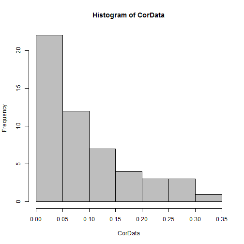
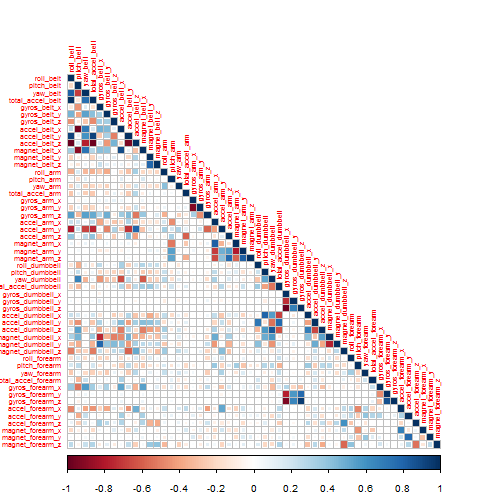

### Practical Machine Learning Project

## SYNOPSIS

Our goal in this project is to use data from accelerometers on the belt, forearm, arm, and dumbell of 6 participants,
to quantify how well they are doing a particular activity.
This will be achieved by applying the best prediction model on the accelerometer data.

The Caret package will be used for data subsetting, training and cross-validation of the model

To do this I made use of caret and randomForest, this allowed me to generate correct answers for each of the 20 test data cases provided in this assignment. I made use of a seed value for consistent results

First, we load training and Testing accelerometer data.

## DATA PROCESSING


```r
library(ggplot2)
library(caret)
```

```
## Loading required package: lattice
```

```r
library(rpart)
library(randomForest)
```

```
## randomForest 4.6-10
## Type rfNews() to see new features/changes/bug fixes.
```

```r
library(rpart.plot)
library(corrplot)
library(gbm)
```

```
## Loading required package: survival
## Loading required package: splines
## 
## Attaching package: 'survival'
## 
## The following object is masked from 'package:caret':
## 
##     cluster
## 
## Loading required package: parallel
## Loaded gbm 2.1
```

## load data

```r
setwd("C:/Data_Scientist/Cours/Practical Machine Learning/Peer Assesment")
if(!file.exists("data")){dir.create("data")}

trainUrl <-"https://d396qusza40orc.cloudfront.net/predmachlearn/pml-training.csv"
download.file(trainUrl, "./data/trainFile.csv")

testUrl <- "https://d396qusza40orc.cloudfront.net/predmachlearn/pml-testing.csv"
download.file(testUrl, "./data/testFile.csv")
```
Convert data contains a number of blank fields, NA values as strings, and fields with the value #DIV/0!” into R NA values

```r
training <- read.csv("./data/trainFile.csv", row.names = 1, na.strings = c("#DIV/0!", "", " ", "NA"))
testing <- read.csv("./data/testFile.csv", row.names = 1, na.strings = c("#DIV/0!", "", " ", "NA"))
```

The train dataset contains 19622 observations and 159 variables, 
while the test data set contains 20 observations and 159 variables. 
The "classe" variable in the train set is the outcome to predict.

## Clean data


```r
#Seclect variables to use in the analysis: the predicted“classe”,
# all the variables begining with “roll”, “pitch”, “yaw”, “total_accel”,“gyros”,“accel” and “magnet”

names<-names(training)
subsetnames<-grep("^roll_|^pitch|^yaw_|^total_accel|^gyros_|^accel_|^magnet|classe",names,value=T)
#creating a subset with the variables selected
training<- subset(training,select=subsetnames)

names<-names(testing)
subsetnames<-grep("^roll_|^pitch|^yaw_|^total_accel|^gyros_|^accel_|^magnet|classe",names,value=T)
testing<-subset(testing,select=subsetnames)

# remove near zero covariates
nsv <- nearZeroVar(training, saveMetrics = T)
training <- training[, !nsv$nzv]

# remove variables with more than 90% missing values
na_v <- sapply(colnames(training), function(x) if(sum(is.na(training[, x])) > 0.9*nrow(training)){return(T)}else{return(F)})
training <- training[, !na_v]
```
After removing 0 near zero covariates, and 0 variables with more than 90% missing values,
now the train dataset contains 19622 observations and 53 predictors.

## Slice Data
We can now split the cleaned train set into a pure train data set (70%) and a test data set (30%).
We will use the test data set to conduct cross validation in future steps.


```r
set.seed(165) # For reproducibile purpose
inTrain <- createDataPartition(training$classe, p=0.70, list=F)
trainData <- training[inTrain, ]
testData <- training[-inTrain, ]
```
The new training dataset contains 13737 observations while the testing data set contains 5885 observations.

**The next step explores if there is correlation between variables.**


```r
#calculate correlations between "classe" variable and predictors
predictors<-colnames(trainData[, -ncol(trainData)])
CorData <- abs(sapply(predictors, function(x) cor(as.numeric(trainData[, x]), as.numeric(trainData$classe), method = "spearman")))

# plot Histogram of Correlations 
hist(CorData, col="gray")
```

 
With a maximum of 32 percent of correlation, there doesn't seem to be any strong predictors that correlates with classe well,
so linear regression model is probably not appropriate in this case.


```r
#Plot correlations between predictors with library(corrplot)
par(mar=c(4.1,2,2,1))
CorPredict<-cor(trainData[,-ncol(trainData)])
corrplot(CorPredict, type = "lower",method = "square",tl.cex=.6)
```

 
Between the variables, there are many which are highly correlated, due to the high dimensionality in the data, we are going to reduce the dimension on it.
The principal component pre-processing was applied to trainData and testData subsets of the training set.


```r
#pre processing with pca
set.seed(166)
preProc <- preProcess(trainData[,-ncol(trainData)], method = "pca", thresh = 0.95)
trainingPC <- predict(preProc, trainData[,-ncol(trainData)])
testingPC <- predict(preProc, testData[,-ncol(testData)])
```

There is now a new set of variables which retain the major variability. Boosting and random forests algorithms may generate more robust predictions for our data. 

**Boosting model**


```r
set.seed(167)
#run boosting algorithm with library(gbm)
#Fit model with boosting algorithm and 10-fold cross validation.

boostFit <- train(trainData$classe ~ ., method = "gbm", data = trainingPC,
 verbose = F, trControl = trainControl(method = "cv", number = 10))
```

```
## Loading required package: plyr
```

```r
boostFit
```

```
## Stochastic Gradient Boosting 
## 
## 13737 samples
##    23 predictor
##     5 classes: 'A', 'B', 'C', 'D', 'E' 
## 
## No pre-processing
## Resampling: Cross-Validated (10 fold) 
## 
## Summary of sample sizes: 12364, 12362, 12365, 12363, 12364, 12363, ... 
## 
## Resampling results across tuning parameters:
## 
##   interaction.depth  n.trees  Accuracy   Kappa      Accuracy SD
##   1                   50      0.5616269  0.4381758  0.014549807
##   1                  100      0.6184070  0.5139902  0.012397877
##   1                  150      0.6491286  0.5538846  0.016076627
##   2                   50      0.6572802  0.5642705  0.008716787
##   2                  100      0.7268730  0.6536523  0.008241958
##   2                  150      0.7664718  0.7040484  0.007340570
##   3                   50      0.7177015  0.6418739  0.011279054
##   3                  100      0.7879485  0.7312347  0.011505817
##   3                  150      0.8216501  0.7741056  0.007717567
##   Kappa SD   
##   0.019091650
##   0.015572610
##   0.020243943
##   0.010972989
##   0.010678994
##   0.009328453
##   0.014365948
##   0.014739087
##   0.009824841
## 
## Tuning parameter 'shrinkage' was held constant at a value of 0.1
## Accuracy was used to select the optimal model using  the largest value.
## The final values used for the model were n.trees = 150,
##  interaction.depth = 3 and shrinkage = 0.1.
```

```r
Acc_BF <- confusionMatrix(testData$classe,predict(boostFit,testingPC))
Acc_BF$overall[1]
```

```
##  Accuracy 
## 0.8161427
```
The boosting algorithm generated a good model with accuracy = 81.61 percent. 

** Random forests model**


```r
set.seed(168)
#Fit model with random forests algorithm and 10-fold cross validation.
rfFit <- train(trainData$classe ~ ., method = "rf", data = trainingPC, importance = T,
trControl = trainControl(method = "cv", number = 10))
Acc_RF<-confusionMatrix(testData$classe,predict(rfFit,testingPC))
RMS_RF <- 1 - as.numeric(Acc_RF$overall[1])
```

**Final model and prediction**

The random forests algorithm generated a very accurate model with accuracy = 97.47 percent close to 100, and the estimated out-of-sample error is 2.53 percent.
Compared to boosting model, this model has overall better performance in terms of accuracy as we see from the percents. 
- The final random forests model contains 500 trees with 24 variables tried at each split. 

** Predict the test set and output results for automatic grader.**


```r
# final model
rfFit$finalModel
```

```
## 
## Call:
##  randomForest(x = x, y = y, mtry = param$mtry, importance = ..1) 
##                Type of random forest: classification
##                      Number of trees: 500
## No. of variables tried at each split: 2
## 
##         OOB estimate of  error rate: 2.52%
## Confusion matrix:
##      A    B    C    D    E class.error
## A 3870    9   14   10    3  0.00921659
## B   42 2573   38    1    4  0.03197893
## C    5   35 2331   22    3  0.02712855
## D    3    2  104 2138    5  0.05062167
## E    3   10   20   13 2479  0.01821782
```

```r
# prediction
testing_PC <- predict(preProc, testing[,-ncol(trainData)])
prediction <- as.character(predict(rfFit, testing_PC))
length(prediction)
```

```
## [1] 20
```
